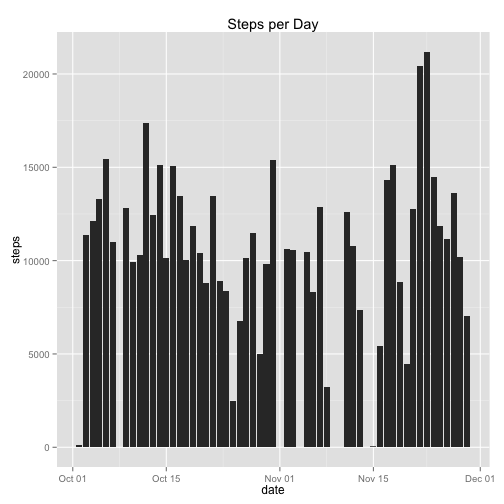
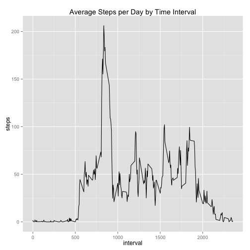
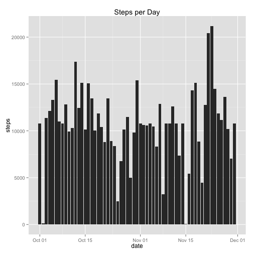
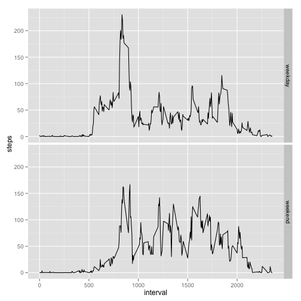

# Reproducible Research: Peer Assessment 1

This report looks at processing and visualizing data collected from a personal activity monitoring device.

## Loading and preprocessing the data

We'll start by loading the data from the `activity.zip` file provided in the repository and changing the class of the `date` variable to Date and the `steps` variable to numeric.


```r
df <- read.csv(unz("activity.zip", "activity.csv"), stringsAsFactors = FALSE)

# transform date column to class Date and steps to numeric
df$date <- as.Date(df$date)
df$steps <- as.numeric(df$steps)
```


## What is mean total number of steps taken per day?

Next we create a histogram of the total number of steps per day with `NA` (ie missing) values removed.


```r
# load packages
require("ggplot2")
require("dplyr")

# create data frame with NAs removed
dfc <- df[complete.cases(df), ]

# take sum of steps grouped by day using dplyr functions
dfc <- dfc %.% group_by(date) %.% summarise(steps = sum(steps))

# create histogram
ggplot(dfc, aes(date, steps)) + geom_bar(stat = "identity") + ggtitle("Steps per Day")
```

 


Next we'll calculate the **mean number of steps taken per day**:


```r
# show mean of total steps taken per day
mean(dfc$steps)
```

```
## [1] 10766
```


As shown above the **mean is 10,766 steps**.

The we'll calculate the **median number of steps taken per day**:


```r
# show median total number of steps taken per day
median(dfc$steps)
```

```
## [1] 10765
```


As shown above the **median is 10,765 steps**.

## What is the average daily activity pattern?

To visualize the average daily activity pattern, we'll remove observations coded as `NA` and calculate the average number of steps per day by time 5 minute time interval.


```r
# create data frame with sum of steps by 5 min interval
dfc <- df[complete.cases(df), ]
dfc <- dfc %.% group_by(interval) %.% summarise(avg_steps = mean(steps))
```


Then we'll plot the results.


```r
# create time series plot
ggplot(dfc, aes(interval, avg_steps)) + geom_line() + ylab("steps") + ggtitle("Average Steps per Day by Time Interval")
```

 


Next we'll display **the time interval that contains the maximum number of steps**:


```r
# show interval with maximum number of average number of steps per day
dfc[dfc$avg_steps == max(dfc$avg_steps), ]
```

```
## Source: local data frame [1 x 2]
## 
##     interval avg_steps
## 104      835     206.2
```


As shown above the **time interval is 835**.

## Imputing missing values

In the previous calculations and plots we've removed `NA` observations. Going back to the original data frame (`df`) we'll calculate the total number of `NA` values in the dataset:


```r
# show number of NAs in dataset
sum(is.na(df))
```

```
## [1] 2304
```


As shown above **the number of `NA` values is 2,304**.

We'll replace the `NA` values in the dataset. Our **strategy** will be to loop through the data frame and replace each `NA` value with the corresponding average steps value for that time interval as calculated earlier in the `dfc` data frame. This new dataset with the missing data filled in will be called `df_new`.


```r
# create copy of original dataset
df_new <- df

# loop through data frame and replace NA values with average by interval
i <- 1
for (i in i:nrow(df_new)) {
    if (is.na(df_new$steps[i]) == TRUE) {
        df_new$steps[i] <- select(filter(dfc, interval == df_new$interval[i]), 
            avg_steps)
    }
}
```


Next we'll create a histogram with the `df_new` dataset showing the total number of steps taken each day. First we'll sum the total steps by day:


```r
# sum steps by day
df_new$steps <- as.numeric(df_new$steps)
df_new_sum <- df_new %.% group_by(date) %.% summarise(steps = sum(steps))
```


Then create the histogram:


```r
# create histogram of total steps by day
ggplot(df_new_sum, aes(date, steps)) + geom_bar(stat = "identity") + ggtitle("Steps per Day")
```

 


Then we'll **calculate the mean**:


```r
# show mean
mean(df_new_sum$steps)
```

```
## [1] 10766
```


As shown above **the mean is 10,766**.

And the **median**:


```r
# show median
median(df_new_sum$steps)
```

```
## [1] 10766
```


As shown above **the median is 10,766**.

By imputing new values in the `NA` observations the **mean** number of steps per day has remained the same, which is a function of replacing `NA` values with the average per day. But the **median** number of steps increased from 10,765 steps to 10,766 steps. The **impact** of imputing missing data has increased the median number of steps per day in the dataset while not affecting the **mean** number of steps since the strategy we've chosen adds **mean values** to the dataset which keeps the **mean** unchanged.

## Are there differences in activity patterns between weekdays and weekends?

Lastly we'll look at the differences in activity on weekdays vs. weekends. First we'll use a combination of the `weekdays()` function to map the day of the week from the `date` value in the dataset, then change the class of the variable to a factor.


```r
# create weekday/weekend variable
i <- 1
for (i in i:nrow(df_new)) {
    if (weekdays(df_new$date[i]) %in% c("Monday", "Tuesday", "Wednesday", "Thursday", 
        "Friday")) {
        df_new$day[i] <- "weekday"
    } else if (weekdays(df_new$date[i]) %in% c("Saturday", "Sunday")) {
        df_new$day[i] <- "weekend"
    }
}

# change day variable to factor
df_new$day <- as.factor(df_new$day)
```


Next we'll create a panel plot using the `ggplot2` package visualizing the activity differences on weekdays vs. weekends by 5 minute time intervals. First we'll create a data frame with the average number of steps per day by time interval:


```r
# take the average steps per day by weekday/weekend by time interval
dfg <- df_new %.% group_by(interval, day) %.% summarise(steps = mean(steps))
```


Then create the plot:


```r
# plot weekday vs weekend
ggplot(dfg, aes(interval, steps)) + geom_line() + facet_grid(day ~ .)
```

 


Observations from the comparison plots:

* There is a higher amount of activity from 5am - 9am (500 - 900 interval) on weekdays compared to weekends

* On weekends there is more activity between 10am - 3pm (1000 - 1500 interval) when compared to weekdays

* Also on weekends the activity around 7pm - 9pm (1900 - 2100) is much higher compared to weekdays

------------------
